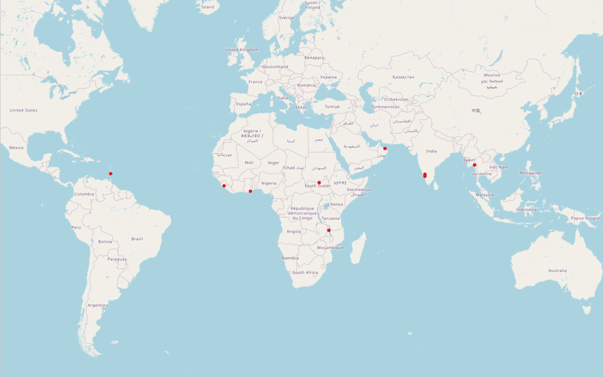

# Ramp Baseline Model for Building Footprint Segmentation

The Replicable AI for Microplanning (Ramp) deep learning model is a semantic segmentation one which detects buildings from satellite imagery and delineates the footprints in low-and-middle-income countries (LMICs) using satellite imagery and enables in-country users to build their own deep learning models for their regions of interest. The architecture and approach were inspired by the Eff-UNet model outlined in this [CVPR 2020 Paper](https://openaccess.thecvf.com/content_CVPRW_2020/papers/w22/Baheti_Eff-UNet_A_Novel_Architecture_for_Semantic_Segmentation_in_Unstructured_Environment_CVPRW_2020_paper.pdf).

MLHub model id: `model_ramp_baseline_v1`. Browse on [Radiant MLHub](https://mlhub.earth/model/model_ramp_baseline_v1).

## Training Data

- [Ghana Source](https://api.radiant.earth/mlhub/v1/collections/ramp_accra_ghana_source)
- [Ghana Labels](https://api.radiant.earth/mlhub/v1/collections/ramp_accra_ghana_labels)
- [India Source](https://api.radiant.earth/mlhub/v1/collections/ramp_karnataka_india_source)
- [India Labels](https://api.radiant.earth/mlhub/v1/collections/ramp_karnataka_india_labels)
- [Malawi Source](https://api.radiant.earth/mlhub/v1/collections/ramp_mzuzu_malawi_source)
- [Malawi Labels](https://api.radiant.earth/mlhub/v1/collections/ramp_mzuzu_malawi_labels)
- [Myanmar Source](https://api.radiant.earth/mlhub/v1/collections/ramp_hpa_an_myanmar_source)
- [Myanmar Labels](https://api.radiant.earth/mlhub/v1/collections/ramp_hpa_an_myanmar_labels)
- [Oman Source](https://api.radiant.earth/mlhub/v1/collections/ramp_muscat_oman_source)
- [Oman Labels](https://api.radiant.earth/mlhub/v1/collections/ramp_muscat_oman_labels)
- [Sierra Leone Source](https://api.radiant.earth/mlhub/v1/collections/ramp_manjama_sierra_leone_source)
- [Sierra Leone Labels](https://api.radiant.earth/mlhub/v1/collections/ramp_manjama_sierra_leone_labels)
- [South Sudan Source](https://api.radiant.earth/mlhub/v1/collections/ramp_bentiu_south_sudan_source)
- [South Sudan Labels](https://api.radiant.earth/mlhub/v1/collections/ramp_bentiu_south_sudan_labels)
- [St Vincent Source](https://api.radiant.earth/mlhub/v1/collections/ramp_mesopotamia_st_vincent_source)
- [St Vincent Labels](https://api.radiant.earth/mlhub/v1/collections/ramp_mesopotamia_st_vincent_labels)

## Related MLHub Dataset

[Ramp Building Footprint Datasets](https://mlhub.earth/datasets?search=ramp)

## Citation

DevGlobal (2022) “Ramp Baseline Model for Building Footprint Segmentation”, Version 1.0, Radiant MLHub. [Date Accessed]
Radiant MLHub. <https://doi.org/10.34911/rdnt.1xe81y>

## License

CC BY-NC 4.0

## Creator

[DevGlobal](https://dev.global/)

## Contact

info@dev.global

## Applicable Spatial Extent

[Download spatial_extent.geojson](./spatial_extent.geojson)

© [OpenStreetMap](https://www.openstreetmap.org/copyright) contributors

## Applicable Temporal Extent

| Start | End |
|-------|-----|
| 2007-10-01 | present |

## Learning Approach

Supervised

## Prediction Type

Segmentation

## Model Architecture

Eff-UNet

## Training Operating System

Linux

## Training Processor Type

GPU

## Model Inferencing

Review the [GitHub repository README](../README.md) to get started running
this model for new inferencing.

## Methodology

This baseline building footprint detection model is trained to facilitate mapping building footprints in regions that are poorly mapped and using high resolution satellite imagery. The model was developed as part of the Replicable AI for Microplanning (Ramp) project. You can read a full documentation of the Ramp project, including the model training on the [Ramp website](https://rampml.global/project-introduction/). The model card is also accessible [here](https://rampml.global/ramp-model-card/).

### Training

The model is designed to work with satellite imagery of 50 cm or higher spatial resolution. The training data for this model covers multiple regions across several Low and Middle Income Countries (LMIC) including Ghana, India, Malawi, Myanmar, Oman, Sierra Leone, South Sudan and St Vincent.

Two augmentation functions were applied to the training data: 1) Random Rotation, and 2) Random Change of Brightness, Contrast and Saturation (aka ColorJitter). Training uses a batch size of 16 with an Adam optimizer at a Learning Rate (LR) of 3E-04 and an early stopping function.

### Model

This model is developed using the Eff-UNet model architecture outlined in this [CVPR 2020 Paper](https://openaccess.thecvf.com/content_CVPRW_2020/papers/w22/Baheti_Eff-UNet_A_Novel_Architecture_for_Semantic_Segmentation_in_Unstructured_Environment_CVPRW_2020_paper.pdf). For a detailed architecture of the model, refer to Figures 3-5 in the paper.

### Structure of Output Data

The model generates a multi-mask prediction including the following classes: `background`, `buildings`, `boundary`,`close_contact`. Output masks will have the same basename as the input chips, with the suffix `pred.tif`. The suffix `pred.tif` is used so that predicted masks will not be confused with truth masks.

These predictions are then post-processed to a binary mask for 'building' and 'background', and from there the polygons are delineated. The final prediction is one single GeoJSON file for all the chips input to the model (tile boundaries are removed).
